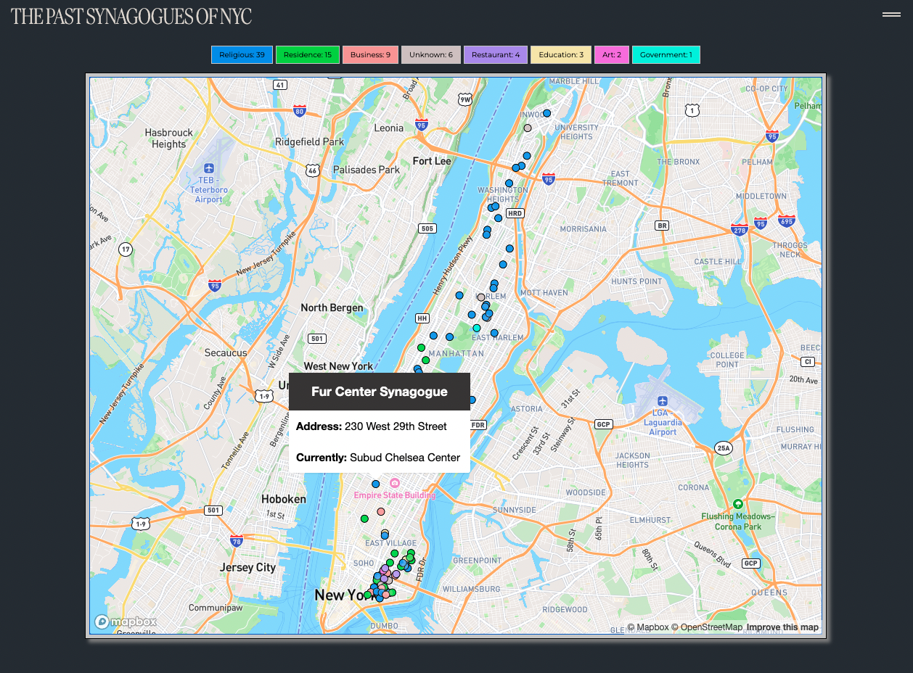

# nyc-synagogue-map

*[Live Demo](https://nyc-lostsynagogues.netlify.app/)
*[More Information about the project](https://stanno.us/jewsofnewyork)

The website displays 79 synagogues in New York City that have been repurposed, such as being converted into other religious places of worship, private residences, businesses, restaurants, education, art, and governmental buildings. The synagogues are shown on a map, and visitors can click on each one to see more information about its origins and the current occupants (as of 2013). The website's purpose is to document the adaptive reuse of these historical buildings and analyze historical trends, as well as provide a resource for those interested in the Jewish history of New York City. This website was developed as my final project in the course Jews of New York, taught by Professor Sandra Fox at New York University.

### Tools
* Mapbox API
* [The Lost Synagogues of Manhattan by Ellen Levitt](https://www.avotaynu.com/books/LostSynagoguesManhattan.html)
* This data is sourced from 2013 - please feel free to contact me at stannostudio@gmail.com to update the map
